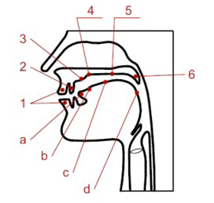
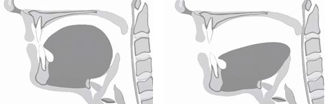
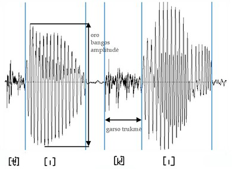
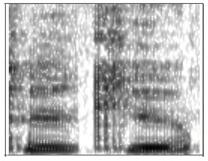

# 語音學分支（Fonetikos šakos）

在**語音學**（fonetika）這門科學中，分為四個分支：**發音語音學**（artikuliacinė fonetika）、**聲學語音學**（akustinė fonetika）、**感知（聽覺）語音學**（perceptyvioji (audicinė) fonetika）與**功能語音學（音韻學）**（funkcinė fonetika (fonologija)）。它們每一個都有自己的研究方法和工具——**語音**（garsas）的本質和功能是從特定的角度來確定的。

功能語音學，或**音韻學**（fonologija），通常被視為一門獨立的科學。然而，這門科學無法與純粹的語音學脫鉤：音韻學元素及其關係只能在具體的言語行為中找到，並透過語音學的概念和**範疇**（kategorija）來描述。

## 發音語音學（Artikuliacinė fonetika）

發音語音學（拉丁語*articulātio* < *articulo*「我清晰發音，我分割」）分析產生語言語音時**發音器官**（kalbos padargai）的活動。語言是從說話者的角度來研究的。

發音器官包含**聲帶**（balso stygos）、舌頭（其前、中、後部）、嘴唇、前齒、**齒齦**（alveolės）（上排牙齒根部的部位）、**硬齶**（kietasis gomurys）與**軟齶**（minkštasis gomurys）。在發音時，咽腔、口腔、鼻腔也很重要；空氣從肺部經由支氣管、氣管與喉頭進入這些腔室。

**圖1.** 發音器官：1–嘴唇，2–牙齒，3–齒齦，4–齒齦後部，5–硬齶，6–軟齶與小舌；a–舌尖，b–舌前部，c–舌中部，d–舌後部（來源：Kazlauskienė A. Bendrinės lietuvių kalbos fonetikos ir fonologijos pagrindai. Vadovėlis. Kaunas: VDU, 2018, p. 50）

語音發音特徵的測定。發音特徵的測定採用傳統方法（齶位描記法、X光線照相法、唇位描記法、記音鼓波形法）以及更現代的方法。獲得的圖像顯示所研究語音的一個或多個發音特徵。

在**齶位圖**（palatograma）（拉丁語*palatum*「齶」，希臘語*γράμμα*「書寫符號，線條；圖像」）中可以看到記錄在齶上的舌頭抬升痕跡。應用當今的電子齶位描記方法時，會使用帶有電極的特殊人造齶。當舌頭觸碰到這些電極時，電腦會記錄下舌頭觸碰的位置與方式。

**X光圖**（rentgenograma）顯示發音器官的側面位置。這種用於產生特定波長電磁輻射並以此進行透視的設備，是以其發明者德國物理學家威廉·倫琴（V.K.Röntgen）的姓氏命名的。如今，取代X光線照相研究的，越來越多是選擇對健康危害較小的磁共振或超聲波舌部活動紀錄。這些方法能獲取顯示發音時舌頭形狀、位置與動作的數據。

**唇位圖**（labiograma）（拉丁語*labium*「嘴唇」）呈現發音時嘴唇的位置。通常使用一般相機拍攝或攝影機錄影。

在**記音鼓波形圖**（kimograma）（希臘語*kỹma*, *κῦμα*「波浪」）中會記錄下來自鼻腔與口腔的氣流模式。

說話過程各個瞬間的氣流總量由氣流計測量。使用特殊的面罩可以測量出透過口腔和鼻腔呼出的氣流。如果同時也記錄到氣流通過鼻腔，就表示發出的語音具有**鼻化**（nosinimas）特徵。

聲帶的活動由喉鏡來記錄。一根末端裝有攝影鏡頭的軟管從鼻子插入。獲取的影像會傳送到電腦並進行處理。更現代的方法是電子喉門測量圖。將兩個小電極固定在脖子上，靠近甲狀腺與喉結處。說話時有關聲帶振動的數據會傳送到電腦，並繪製成曲線。請比較**元音**（balsis）*i*[ɪ]與*a*[ˈɐ]的發音圖像（見圖2）。可以看出，發元音*i*[ɪ]時，舌頭向齶部抬高，靠近前齒；以寬闊的邊緣接觸它。發元音*a*[ˈɐ]時，舌頭遠離前齒，並以邊緣向齶後部抬升。

**圖2.** 發元音 *i*[ˈɪ]（左）與 *a*[ˈɐ]（右）時的發音器官側面圖（來源：Mokomoji tarties ir kirčiavimo programa. Kaunas: VDU; https://tartis.vdu.lt/fonetika-ir-tartis/igudziu-tobulinimas/garsu-ypatybes/）

實驗性地研究立陶宛語語音系統始於20世紀上半葉。最早的研究者是瑞典**語言學家**（kalbininkas）理查德·艾克布洛姆（Richard Ekblom）和尤爾吉斯·格魯利斯（Jurgis Gerulis/Georg Gerulis）。大約在1930年，隨著維陶塔斯馬格努斯大學建立實驗語音學實驗室，研究變得更加密集。安塔納斯·薩利斯（Antanas Salys）、埃爾日別塔·米卡勞斯凱特（Elzbieta Mikalauskaitė）、彼得拉斯·約尼卡斯（Petras Jonikas）、亞歷山德拉斯·日爾古利斯（Aleksandras Žirgulys）等語音學家分析了立陶宛**標準語**（bendrinė kalba）與**方言**（tarmė）語音的齶位圖。隨後在20世紀下半葉，瓦萊里婭·瓦伊特克維丘特（Valerija Vaitkevičiūtė）、安塔納斯·帕克里斯（Antanas Pakerys）、亞歷克薩斯·吉爾代尼斯（Aleksas Girdenis）及其他科學家進行了現代標準語語音學的實驗研究。到了21世紀，主要透過實驗研究標準語和方言的語音學家有阿斯塔·卡茲勞斯凱內（Asta Kazlauskienė）及其VDU的同事，以及麗瑪·巴克希埃內（Rima Bakšienė）、阿斯塔·萊斯考斯凱特（Asta Leskauskaitė）、約麗塔·烏爾巴納維奇埃內（Jolita Urbanavičienė）（LKI）、埃瓦爾達斯·什瓦蓋里斯（Evaldas Švageris）（VU）。

## 聲學語音學（Akustinė fonetika）

聲學語音學（希臘語*akoustikós*, *ἀκουστικός*「聽覺的」）分析由發音器官形成的語音（作為某種機械性的空氣振動）的特徵。語言透過儀器來研究，研究者與研究對象保持距離——處於觀察者的立場。

語音是動能的一種形式。振動的物體帶動周圍的空氣分子，其壓縮和稀疏產生壓力變化，形成聲波。聲波到達耳朵後，轉化為電子訊號，從而被聽見。

儀器可以測定語音的物理特性：振動頻率（每秒次數）、音高、週期性、**強度**（intensyvumas）（力度）、時長。

聲學語音學在開發基於現代語言科技的軟體時尤其重要。例如，機器翻譯、聽寫系統等。

語音的主要聲學特徵有音高、強度（力度）、時長（長度）、音色。

語音的音高取決於振動頻率，而頻率由振動聲帶的長度與緊張程度決定。振動頻率越大，聲音越高。例如，多數女性的聲音比男性高，因為她們的聲帶較短；女性聲帶長度為15–18毫米，男性為20–24毫米。振動頻率以赫茲（Hz）測量。1Hz等於每秒一次振動。

語音的強度（力度）取決於振動體所引起的聲波振幅——即偏離平衡位置的距離。這是垂直軸上波峰最高點與波谷最低點之間的距離；在這種情況下，水平軸表示時長。強度以分貝（dB）為單位測量。

語音的時長（長度）——即振動體產生的振動持續的時間。例如，立陶宛語中帶**重音**（kirtis）的元音比不帶重音的元音長，請比較單詞*tiki̇̀*[tʲɪˈkʲɪ]「信」、*tadà*[tɐˈdɐ]「那時」中元音*i*[ɪ]、*a*[ɐ]的長短；**摩擦音**（pučiamasis priebalsis）比**塞音（爆破音）**（sprogstamasis priebalsis）長，請比較單詞*žùdo*[ˈʒʊdoː]「殺害」:*bùdo*[ˈbʊdoː]「醒來」、*tãšo*[²ˈtɑːʃoː]「砍削」、*tãko*[²ˈtɑːkoː]「小徑」中**輔音**（priebalsis）*ž*[ʒ]與*b*[b]、*š*[ʃ]與*t*[t]的長短。時長以毫秒（ms）測量。

語音的音色——由泛音（換言之，次要音調）產生的語音色彩；即泛音與基音的比例。音色由聲帶振動頻率，以及口腔、鼻腔與咽腔的體積和形狀決定。例如，同一個人說話時，**後元音**（užpakalinės eilės balsis）（長短*a*、*o*、*u*（[ɑː]、[ɐ]、[oː]、[ɔ]、[uː]、[ʊ]））共鳴的音色比**前元音**（priešakinės eilės balsis）（長短*e*、*i*和*ė*（[æː]、[ɛ]、[iː]、[ɪ]、[eː]））更低。發後元音時，舌頭遠離前齒——口腔的空間比發前元音時舌頭靠近牙齒時更大、更寬。

用語音儀器測定聲學特徵。許多語音的聲學特徵可以透過**示波圖**（oscilograma）（拉丁語*oscillo*「我搖擺」，希臘語*γράμμα*「書寫符號，線條；圖像」）與**頻譜圖**（spektrograma）（拉丁語*spectrum*「意象，圖像」）來確定。這些圖像是利用示波器與頻譜儀獲得的。

示波器是一種將發音器官引起的聲波振動轉換為電子振動的設備。記錄下來的聲波曲線中，重複的低頻波動顯示基音音高，振幅顯示強度，長度顯示時長。

圖3呈現了**動詞**（veiksmažodis）**現在時**（esamasis laikas）**第二人稱**（antras asmuo）形式*tiki̇̀*[tʲɪˈkʲɪ]以陳述**語調**（intonacija）發音時的示波圖。比較該形式中的兩個元音*i*[ɪ]，可以看出第一個不帶重音的元音，其振動較稀疏且持續時間較短，振幅也較小。這意味著不帶重音的元音發音時音調較低也較弱，且比帶重音的對應元音更短。

**圖3.** 單詞 *tiki̇̀*[tʲɪˈkʲɪ]的示波圖
* oro bangos amplitudė「聲波振幅」
* garso trukmė「語音時長」
* [tʲ] [ɪ] [kʲ] [ɪ]

頻譜儀將元音與響亮輔音的聲波轉化為電子振動後，分解為簡單的組成振動。頻譜圖上會顯現振動頻率增強的區域，稱為**共振峰**（formantė）（見圖4——單詞*tiki̇̀*[tʲɪˈkʲɪ]的聲譜圖像）。最重要的是位於圖像底部的首兩個共振峰。它們被標記為F1與F2。共振峰相對於頻譜中心（1500Hz）的位置——分布在中心附近或邊緣——顯示了元音元素的定性特徵：聲學特徵以及對應的發音特徵。

**圖4.** 單詞 *tiki̇̀*[tʲɪˈkʲɪ]的頻譜圖

F1與F2相互靠近表示緊湊元音[ɑː]、[ɐ]、[æː]、[ɛ]，能量集中在相當狹窄的650–1700Hz頻率範圍內。這些元音在舌頭垂直位移上屬於**低元音**（žemutinio pakilimo balsis）。位於頻譜邊緣的共振峰表示擴散的，換句話說，能量分散的元音。這類元音有[uː]、[ʊ]（就舌頭水平位移而言屬於後元音）與[iː]、[ɪ]（前元音）。第一對元音的F1和F2位於頻譜的同一側邊緣，而第二對則分別位於兩側邊緣。請比較標準語元音共振峰的平均值：[uː]F1=300Hz，F2=600Hz；[iː]F1=250Hz，F2=2400Hz（Girdenis 1995: 199）。第一共振峰取決於元音發音的開口度與舌頭抬高程度，第二共振峰取決於發音位置，即舌頭抬升最高點的位置。

## 感知（聽覺）語音學（Perceptyvioji fonetika）

語音的物理特徵可以透過儀器（聲學語音學領域）或聽覺來測定。發出語音的感知特徵由感知（聽覺）語音學（拉丁語*perceptio*「感知」，或拉丁語*auditio*「聽見」）（Crystal 2003: 42）、心理聲學語音學來研究。語言是從聽者的角度來審視的。

感知語音學旨在確定一般人類有聲語言共有的普遍特徵，以及個別語言語音單位所具備的特定特徵。主要關注以下口語感知問題：聽覺系統要素的功能是什麼；高級神經活動的活躍度如何定義；哪些物理語音特徵決定了將其歸入特定的**音位**（fonema）；語音音色、發音失誤、背景噪音和其他溝通干擾的影響有多大；如何識別和學習陌生、未知語言的語音。這些都是不容易解決的問題。例如，音位的識別很複雜，因為語音流中語音的聲學與發音特徵並不固定，它們不斷變化、互相協調。

研究確定，在解碼語言結構時，人類聽覺系統只挑選具有意義的（區分性的）語言信號特徵——也就是那些如果缺失將導致傳遞內容無法理解的特徵。這體現了「音位聽覺」——在感知語音學中，這個概念被認為是最重要的一個。例如，在立陶宛語中，輔音的**軟化性（軟齶化）**（palatališkumas / minkštumas）被認為是具備意義的：像*galù*[ɡɐˈlʊ]「用盡」與*galiù*[ɡɐˈlʲʊ̟]「我能」這樣的詞對顯示了單詞與形式意義上的差異。元音時長的差異不僅在立陶宛語，在英語中也被認為是重要的，請比較：*bū̃do*[2ˈbuːdoː]「性格（屬格）」與*bùdo*[ˈbʊdoː]「醒來」；*sheep*[ʃiːp]「羊」與*ship*[ʃip]「船」。長短元音的**對立**（opozicija）在例如俄語中則不存在。

在言語行為中，聽覺感知的訊息通常少於準確識別音位所需的量。這意味著聽者在解釋他們所聽到的內容時，會考慮溝通情境、上下文與話語內容（Girdenis 1995: 201）。甚至視覺信號如手勢、面部表情、可見的發音動作也能增強聽覺感受，並促進意義的識別。

**聽覺系統**。聽覺感知由協調運作的聽覺系統來保障。它由三個部分組成：耳朵（外耳、中耳和內耳）、聽覺神經，以及位於大腦皮層的聽覺區。

耳廓捕捉聲波並將其引導至耳道。振動的耳膜使中耳的聽小骨（錘骨、砧骨和鐙骨）運動。聽小骨放大聲波。通過這些媒介，波浪到達內耳腔。內耳由充滿內淋巴液的耳蝸和毛細胞——聲音受體組成。聲波的振動使耳蝸內的液體流動，而毛細胞將聲波的機械能轉化為神經衝動，並將其傳遞給聽神經。衝動沿聽神經移動至大腦聽覺區。在大腦皮層這個接收和分析感官訊息的接收器中，神經衝動被完全處理：篩選出每一種特定情況下重要且必要的信息，即確定語音或其組合的語音學特徵。如果感知表面受損——毛細胞功能紊亂、細胞死亡，無法再傳輸完整的聲學訊息，就會出現聽覺障礙。

描述聲音響起時聽覺器官壓力感的物理量稱為響度。它可以被視為語音強度的心理物理對應物，儘管這兩個語音特徵之間並沒有直接的依賴關係。響度不僅取決於聲音的力度——振動頻率與形狀也有很大影響。例如，相同力度的情況下，低音聽起來比高音弱。

人類聽覺對中等可聽頻率範圍（700–6000Hz）的聲音最敏感，總體上能分辨16至20000Hz的音高。因此，聽覺系統既能感知到極微弱的聲音，如蚊子的嗡嗡聲，也能感知到極強烈的聲音，如噴氣式發動機的轟鳴聲。大腦不僅處理聲波，還有助於確定聲音來自哪個方向，並評估聲音傳播的空間大小。

聽覺感知語音特徵的測定。為了確定如何感知語音及其他語音元素（重音、**音調**（priegaidė）、語調），哪些特徵被視為區別性特徵，會進行聽覺實驗。這些實驗與一群人——聽眾——共同進行。實驗參與者語言行為的測量數據被用來制定結論。聽覺實驗是心理語言學實驗的一部分。

立陶宛的語音學專家應用了一套既定的研究方法。挑選在某個語音特徵上存在差異的詞對，用它們造出意義明確的句子。由一名或多名播音員讀出。隨後句子以所需順序打亂並呈現給聽眾。聽眾通常聽錄音而非現場演講，因為這樣更容易妥善準備研究材料。用來識別的是從句子中剪切出來、構成**最小對立體**（minimalioji pora）、包含待研究音段的單詞。聽眾指出該單詞屬於兩個可能句子中的哪一個。獲得的數據進行統計評估。當聽眾正確識別大多數單詞（正確率接近100%）時，則認為所研究的詞彙具有顯著特徵上的差異。當正確率在50%左右波動時，則認為聽覺特徵不具備區別性，或者參與者是在猜測（有關方法的更多細節，見 Bacevičiūtė, Rinkauskienė 2009: 70–75）。

在使用儀器準備聽覺實驗研究材料時，對語音元素進行切分——將相關語音或其組合從口語流中分離出來。它們可以被轉移到另一個上下文中（移調），也可以被創造出來（合成和模仿）。聽覺實驗期間會檢驗語音或其組合的自然度——提供給參與者的不僅有真實的聲音，也可以是人工生成的聲音。

因此，感知任務旨在識別語音刺激，並確定它們的異同。

## 功能語音學（音韻學）（Funkcinė fonetika (fonologija)）

語音學不僅涵蓋對語音元素發音、聲學與感知的研究，還包含語音元素的運作。研究語言語音系統、其元素、組合及其執行區分功能的特徵的語音學分支，稱為功能語音學，或音韻學（希臘語*φωνή*「聲音、嗓音」，*λόγος*「詞彙、科學」）。語音元素的區別性特徵在音韻學上是具備意義的，或是相關的（英語*relevant*「重要」 < 中世紀拉丁語*relevāns*「適合、適當、有效」 < 拉丁語*relevo*「我舉起，我減輕，我安慰」）。

人類可以發出具有各種獨特特徵的聲音，但並非所有這些聲音都在構成對立時區分單詞和形式。例如，噴出氣流——**送氣**（aspiracija），作為塞音發音的補充，在立陶宛語中並不具備功能意義。無論怎麼發音：[ˈtʊrʲɪ]或[ˈthʊrʲɪ]，這段語音流都將被理解為表示擁有者存在、控制某物的**第三人稱**（trečias asmuo）動詞形式——[jis]*tùri*「[他]有」。然而，比如說，輔音的軟化性毫無疑問被認為是重要的區別性特徵。它決定了諸如*galù*[ɡɐˈlʊ]「用末端」（**名詞**（daiktavardis）；**單數**（vienaskaita）**工具格**（Įnagininkas））與*galiù*[ɡɐˈlʲʊ̟]「我能」（動詞；現在時第一人稱）；*šuõ*[2ˈʃuɔ]「狗」（名詞；單數**主格**（Vardininkas））與*šiuõ*[2ˈʃʲu̟ɔ]「這」（**代詞**（įvardis）；單數工具格）這樣對立詞項的不同意義。

在不同的語言中，同一元素或特徵可能有不同的待遇：作為音韻學（具備功能意義）的或非音韻學的。前面提到的送氣在古希臘語、梵語、亞美尼亞語、冰島語、韓語、漢語及一些其他語言中是音韻特徵。請比較亞美尼亞語東部方言單詞*տուր*和*թուր*（拉丁字母**轉寫**（transkribavimas）為*tur*、*t‘ur*，發音為[tur]、[tʰur]）：第一個是動詞，意思是「給」，第二個是名詞，其意義為「劍」。

**音韻學元素**（fonologiniai elementai）。音韻學在確定並探討語言中起區分作用的語音元素模型後，旨在就語音系統的本質提出盡可能普遍的主張。音韻學元素分為兩類：**音段（線性）**（segmentinis (linijinis)）與**超音段（韻律）**（supersegmentinis (prozodinis)）元素。音段（拉丁語*segmentum*「片段」）是兩個停頓之間的文本（語言）片段。

在語言流中線性連接且執行區分功能的語音元素稱為音段元素。

最小的音段語音元素稱為音位（希臘語*phōnēma*, *φώνημα*「聲音；嗓音」）。它是一個抽象的元素。音位的具體表現形式是語音，而用音韻學的術語來說，就是**音位變體（同位音）**（fonemos variantas / alofonas）。從功能上看，音位變體並不具備獨立性。

同一音位的各種變體在不同位置得以實現。例如，單詞*rùsti*[ˈrʊsʲtʲɪ]「變棕色」與*ràsti*[ˈrɐsʲtʲɪ]「發現，注意」中，第一個輔音[r]在這兩個詞的發音略有不同。在第一個詞中，它稍微被**圓唇化**（lūpinimas / labializacija），因為它位於降半音的**圓唇元音**（lūpinis balsis）[ʊ]之前——發這個元音時，嘴唇變圓並向前突出，這個特徵也傳遞給了相鄰的輔音[r]。圓唇化的非圓唇輔音在必要時用特殊符號ʷ標記：*rùsti*[ˈrʷʊsʲtʲɪ]。在第二個詞中使用的[r]不會經歷這種圓唇化。這兩個變體同屬一個音位/r/，請比較：*rùsti*[ˈrʊsʲtʲɪ]:*dùsti*[ˈdʊsʲtʲɪ]「窒息，喘息」、*šùsti*[ˈʃʊsʲtʲɪ]「燉煮」與*ràsti*[ˈrɐsʲtʲɪ]:*kàsti*[ˈkɐsʲtʲɪ]「挖掘」。輔音/r/是一個音韻元素，因為它與其他輔音元素構成對立：在同一語音環境下，將一個元素替換為另一個元素，會改變單詞或形式的意義。因此，從聲音序列中提取單一聲音僅作為音位的代表，因為它與有意義的語言單位相關聯。

更大的音段元素是音位鏈：**音節**（skiemuo）、單詞、**語調短語**（frazė）。

超音段元素（拉丁語*super-*「之上」，*segmentum*「片段」）是涵蓋並區分大於一個音位的語言片段的語音元素：音節、單詞、句子。超音段元素本身無法單獨運作，它們與音段元素一起出現——補充它們，如同覆蓋在它們之上。

歸類為超音段元素的有：重音、音調、語調短語語調。探討它們的模型與運作特徵的音韻學分支稱為韻律學（拉丁語*prosōdia* < 希臘語*prosōidía*, *προσῳδία*「伴奏演唱的歌曲；音調」）。這些元素被稱為韻律音位。

長音節的韻律元素是音調，請比較：*vértas*[1ˈʋʲæˑrtɐs]「被刺的」:*ver̃tas*[2ˈʋʲɛrˑtɐs]「有價值的」；*tám*[1ˈtɑˑm]（單數**與格**（Naudininkas））:*tam̃*[2ˈtɐmˑ]（單數**方位格**（Vietininkas））。

單詞的韻律元素是重音，請比較：*stótis*[1ˈstoːtʲɪs]「站立」:*stoti̇̀s*[stoːˈtʲɪs]「車站；其建築」；*tỹli*[2ˈtʲiːlʲɪ]「他/她保持沉默」:*tyli̇̀*[tʲiːˈlʲɪ]「安靜的（陰性）」；*gėlės*[2ˈɡʲeːlʲeːs]（**複數**（daugiskaita）主格）:*gėlės*[ɡʲeː2ˈlʲeːs]（單數**屬格**（Kilmininkas））。

短語的韻律元素是語調，請比較：*Jaũ privažiãvome stõtį.*[2ˈjɛʊˑ pʲrʲɪʋɐ2ˈʒʲæːʋoːmɛ 2ˈstoːtʲiː↘ ǁ]（**直陳語調短語**（tiesioginė frazė））:*Jaũ privažiãvome stõtį?*[2ˈjɛʊˑ pʲrʲɪʋɐ2ˈʒʲæːʋoːmɛ↗ 2ˈstoːtʲiː ǁ]（**疑問語調短語**（klausiamoji frazė））。

可以看出，不僅是音位，音調、重音、語調——即發音單詞、音節和短語時的不同聲音變調——都執行區分單詞及其形式的功能。

音韻學研究的目的與最重要的音韻學概念。音韻學研究旨在確定語言語音元素的功能獨立性，建立音位清單，區分音位類別，並描述它們的關係與同位音。音韻學家的關注核心是功能性，換句話說，語言層面的觀點。

在音韻學研究的描述中使用了各種特殊概念。純粹的語音學專家也採用這些概念。有必要對更重要、被更廣泛使用的概念進行解釋。

**聚合關係**（paradigminiai santykiai）與音位的聚合性識別。術語**範式**（paradigma）（希臘語*paradeigma*, *παράδειγμα*「範例、模型」）表示起作用元素的總和；比方說，在**形態學**（morfologija）科學中，會談論**變格型**（linksniuotė）、**動詞變位型**（asmenuotė）的範式——即詞彙所表現出的形式系統。聚合關係涵蓋屬於同一類別或範式的元素。例如，音位/b/、/p/、/ʒ/之間存在這種關係：在*-ū́ti*[–¹uːtʲɪ]的位置上，它們可以相互替換，隸屬於不同的單詞（*bū́ti*[¹ˈbuːtʲɪ]「成為」、*pū́ti*[¹ˈpuːtʲɪ]「腐爛」、*žū́ti*[¹ˈʒuːtʲɪ]「死亡」）。

聚合性音位識別用來確定哪些聲音對應音位，哪些是同一音位的變體。例如，在立陶宛語中，獨立的音位有**長緊元音**（ilgasis-įtemptasis balsis）與**短鬆元音**（trumpasis-neįtemptasis balsis）、閉元音與開元音，請比較：*vi̇̀s*[ˈʋʲɪs]「將繁殖」:*vỹs*[2ˈʋʲiːs]「將枯萎」；*vi̇̀s*[ˈʋʲɪs]:*vès*[ˈʋʲɛs]「將引導、將帶領」。不構成對立的語音是同一音位的變體（同位音）。例如，單詞*ves*「將引導」發出元音時，可以發得稍微閉合一些，偏向*e*[ɛ]類型，也可以發得稍微開口一些，非常接近元音*a*，但輕微的開口程度並不執行區分功能：在這兩種情況下，單詞直接的含義都是「將引導、將帶領」。

**組合關係**（sintagminiai santykiai）與音位的組合性識別。**語段**（sintagma）（希臘語*syntagma*, *σύνταγμα*「連接的事物」）是指短語的片段——具有單一方向語調的**句法學**（sintaksė）單位；因此這個術語指向運作元素的線性關係。組合關係涵蓋可以相互連接並形成更大組合的元素。例如，音位/b/、/uː/、/tʲ/、/ɪ/之間就存在這樣的關係。這些音位線性連接並構成動詞*bū́ti*[1ˈbuːtʲɪ]。

組合性音位識別確定哪些語音是單一音位，哪些是音位組合。多數聲音是不可分割的整體。較難評估的是立陶宛語的**雙元音**（dvibalsis）*ie*[iɛ]、*uo*[uɔ]以及**塞擦音（破擦音）**（sprogstamasis-pučiamasis (afrikata)）*c*[ʦ]、*č*[ʧ]、*dz*[ʣ]、*dž*[ʤ]——音韻學家通常不會將它們拆分。音段的可分割性是根據兩個原則進行測試的：最小清單原則（盡量分解出越多音段，從而獲得越少的音位）和最規律關係原則（對音段進行解釋時，應使音位組合及其關係的描述盡量簡單）。

最小對立體——並列比較的單詞，其語音組成差異最小，通常僅在一個特徵上不同（拉丁語*minimus*「最小的」）。例如，這類詞對有：*vi̇̀s*[ˈʋʲɪs]「將繁殖」:*vỹs*[2ˈʋʲiːs]「將枯萎」（元音的長度發揮區分功能），*vértas*[1ˈʋʲæˑrtɐs]「被刺的」:*ver̃tas*[2ˈʋʲɛrˑtɐs]「有價值的」（單詞由音調區分）。

最小對立體允許檢查音段的音韻學獨立性。如果在聽覺實驗中，參與者將最小對立體的成員感知為不同的詞彙，則這些音段具有音韻意義：語音是音位，而重音、音調、短語語調是韻律音位。如果對詞對成員的反應被視為同一個重複的單詞，則這些音段不是單獨的音位或韻律音位，而是單一音位或韻律音位的變體（換言之，同位音或同位調）。

對立（拉丁語*oppositio*「矛盾、對立」）——在同一位置使用的音韻學元素的對比。例如，**硬輔音**（kietasis priebalsis）和**軟輔音**（minkštasis priebalsis）在後元音之前構成對立——*galù*[ɡɐˈlʊ]（名詞；單數工具格）:*galiù*[ɡɐˈlʲʊ̟]（動詞；現在時第一人稱）；長緊元音和短鬆元音在重讀與非重讀位置均構成對立——*ti̇̀kti*[ˈtʲɪkʲtʲɪ]「合適，有用」:*tỹkti*[2ˈtʲiːkʲtʲɪ]「安靜，平息」；*ántis*[1ˈɐˑnʲtʲɪs]（單數主格）:*ántys*[1ˈɐˑnʲtʲiːs]（複數主格）。

當談到在同一位置可能出現、相互替換的音段時，對立可被理解為聚合關係的同義詞。

**中和（音位中和）**（neutralizacija）（拉丁語*neutrālis*「中性的」 < *neuter*「既非這個也非那個；兩者皆非」）——在特定位置缺乏音位對立。例如，立陶宛語的**濁音（濁輔音）**（skardusis priebalsis）在詞尾被中和——變成**清音（清輔音）**（duslusis priebalsis），也就是說，在停頓前不能有輔音濁化和清化的對立。請比較：*tàt*[ˈtɐtʰ]「那」（代詞）:*tàd*[ˈtɐtʰ]「所以」（**連詞**（jungtukas））；*jók*[1ˈjo̟ːkʰ]「騎吧」（動詞；**命令式**（liepiamoji nuosaka）第二人稱）:*jóg*[1ˈjo̟ːkʰ]「即，也就是」（連詞）。

這兩對單詞的發音相同，所以看起來[t]與[d]、[k]與[ɡ]像是同一個音位的變體。實際上，這些討論的輔音代表兩個音位，因為在單詞的其他位置（即開頭和中間）是可以存在音韻學對立的，例如：*tãrė*[2ˈtɑːrʲeː]「說」:*dãrė*[2ˈdɑːrʲeː]「做」，*nusė́ta*[nʊ1ˈsʲeːtɐ]「被播滿種子的」:*nusė́da*[nʊ1ˈsʲeːdɐ]「沉積」。

**開連讀（開過渡）**（atviroji sandūra）——連續發音的斷裂。這是一個抽象的音韻學單位，導致相鄰的聲音不互相適應。它們發音時就好像兩者之間有停頓。開連讀的表現並不規律，通常表明**語素**（morfema）（**前綴**（priešdėlis）與**詞根**（šaknis）、兩個詞根）的邊界。在轉寫的例子中，開連讀有時用符號(+)標記，例如：*apspi̇̀to*[ɐp(+)ˈsʲpʲɪtoː]「蜂擁而至」，*saũskelnės*[2ˈsɒʊˑs(+)kʲɛlʲnʲeːs]「尿布」，*LTV*[ɛl(+)tʲeː2ˈʋʲeː]「Lietuvos televizija（立陶宛電視台）」，*sénbernis*[1ˈsʲæˑn(+)bʲɛrʲnʲɪs]「老光棍」。在這些例子中，輔音*p*[p]和*s*[s]不服從連續的軟齶化——保持硬音狀態。

音韻系統——這是特定語言或方言中音韻元素（音位和韻律音位）的總和。所有音韻元素都是在研究了起作用語音及重音、音調、語調特徵後被確定並歸類的。